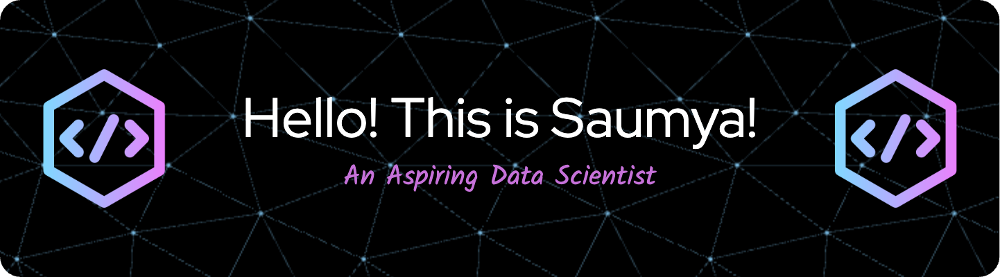

## About Me
I'm currently pursuing an **MS in Data Science and Machine Learning** with a passion for turning data into actionable insights. With **3 years of experience in Business Intelligence**, I love diving deep into data, uncovering hidden patterns, and solving complex problems.

## What I'm Working On
- **Network Anomaly Detection**: [GitHub Repo](https://github.com/Saumya-N/Network-Anomaly-Detection)
- **A/B Testing Blog**: Exploring the latest trends and applications in the industry.

## Skills & Tools

## Projects
- **Network Anomaly Detection App**: A Streamlit app to detect anomalies in network traffic. [GitHub Repo](https://github.com/Saumya-N/Network-Anomaly-Detection)
- **Data Visualization Dashboards**: Interactive dashboards to visualize complex datasets. [Dashboard](https://public.tableau.com/app/profile/saumya.nishi/vizzes)

## Let's Connect

)

## 💡 Fun Facts

- When I'm not crunching numbers or coding, you'll likely find me **meditating** or **bird watching**. It's amazing how observing nature can inspire innovative ideas!
- I'm an avid reader of **thriller novels**. The suspense and intricate plots often mirror the excitement I find in uncovering patterns and insights in data.
- I'm fascinated by **quantum computing in machine learning**. Although I'm still learning, I believe this cutting-edge field holds the key to revolutionary advancements in AI.
- I can spend hours tweaking my data visualizations to make them perfect and aesthetically pleasing. Data + Art = ❤️

---

"Data is a precious thing and will last longer than the systems themselves." - Tim Berners-Lee
